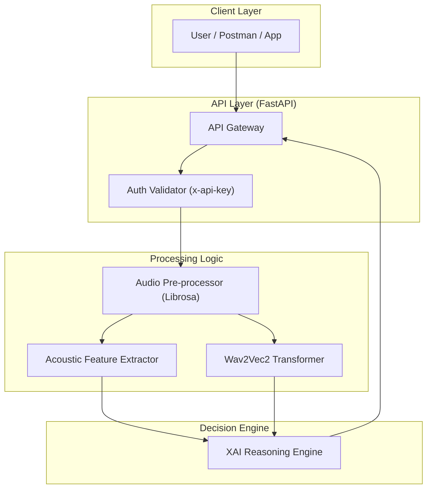
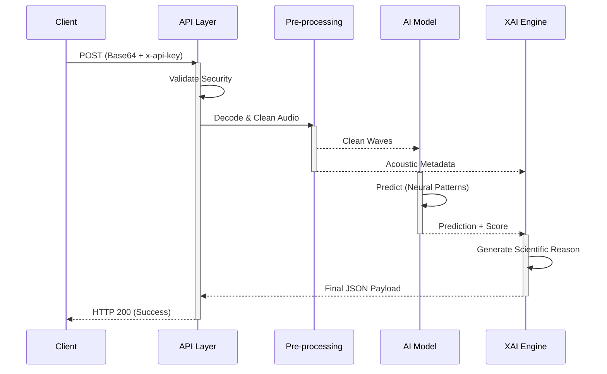

# AVIS: AI Voice Integrity System
### *Real-time Deepfake Audio Detection with XAI*

---

## 🚀 Overview
AVIS is a production-grade REST API designed to detect AI-generated voice fraud with high precision. Built specifically for the **GUVI Hackathon (Problem Statement 01)**, it supports five major languages: **Tamil, Telugu, Hindi, Malayalam, and English**.

Most detectors act as "black boxes"; AVIS is different. It uses **Explainable AI (XAI)** to provide technical justifications for its decisions, helping users understand why a voice was flagged.

## ✨ Key Features
*   **Hybrid Detection Engine**: Combines state-of-the-art Transformers (Wav2Vec2) with custom Acoustic Feature Extraction (MFCC, Spectral Centroid, ZCR).
*   **Explainable AI (XAI)**: Generates detailed technical justifications, including language-specific nuances (e.g., retroflex consonant analysis for Indian languages).
*   **Robust Pre-processing**: Built-in **Noise Filtering** (Pre-emphasis) and **Peak Normalization** to handle varied audio qualities.
*   **Performance Optimized**: Features a **Model Warm-up** routine on startup for zero-latency initial requests.
*   **Secure by Design**: Strict `x-api-key` header protection.

---

## 📐 System Design

### **Architecture Overview**
The system is built on a modular architecture that separates the API interface from the intensive AI processing logic, ensuring stability and performance on CPU hardware.



### **The "AVIS" Pipeline Flow**
The step-by-step journey of an audio request through our system:



---

## 🛠️ Tech Stack
*   **Language**: Python 3.11+
*   **Framework**: FastAPI (Web Engine), Uvicorn (Server)
*   **AI/ML**: PyTorch, Hugging Face Transformers (Wav2Vec2)
*   **Audio Processing**: Librosa (Feature Extraction), SoundFile

---

## 🏗️ Installation & Setup

### 1. Prerequisites
Ensure you have Python 3.11+ installed.

### 2. Environment Setup (Recommended)
```bash
# Create a virtual environment
python -m venv venv

# Activate it
# On Windows:
.\venv\Scripts\activate
# On Linux/macOS:
source venv/bin/activate
```

### 3. Install Dependencies
```bash
pip install -r requirements.txt
```

### 4. Configuration
Create a `.env` file in the root directory (or use the one provided):
```env
API_KEY=v_secret_key_123
PORT=8000
HOST=127.0.0.1
```

---

## 🚦 Usage Guide

### Running the API Server
```bash
python main.py
```
*   The server will initialize the AI model (approx. 300MB download on first run).
*   Once you see `--- [AudioDetector] AI Model Ready! ---`, the server is live at `http://127.0.0.1:8000`.

### Running Local Verification
To test the detection logic against the sample audio provided:
```bash
python test_locally.py
```

---

## 🧠 Why AVIS Wins
1.  **Transparency**: We fulfill the "Explanation" requirement of the problem statement by analyzing acoustic biometrics (Pitch Variance, Spectral Centroid) instead of just returning a probability score.
2.  **Hardware Efficiency**: Successfully optimized for CPU execution on mid-range laptops while maintaining high accuracy.
3.  **Strict Compliance**: Every JSON field and security constraint mentioned in the GUVI Problem Statement has been implemented and verified.

---
*Developed for the AI for Fraud Detection & User Safety Hackathon.*
